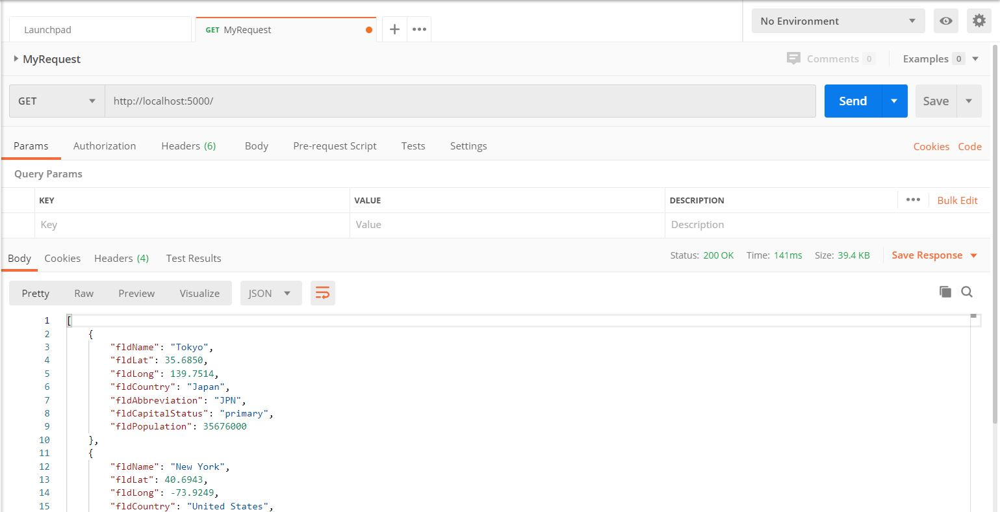
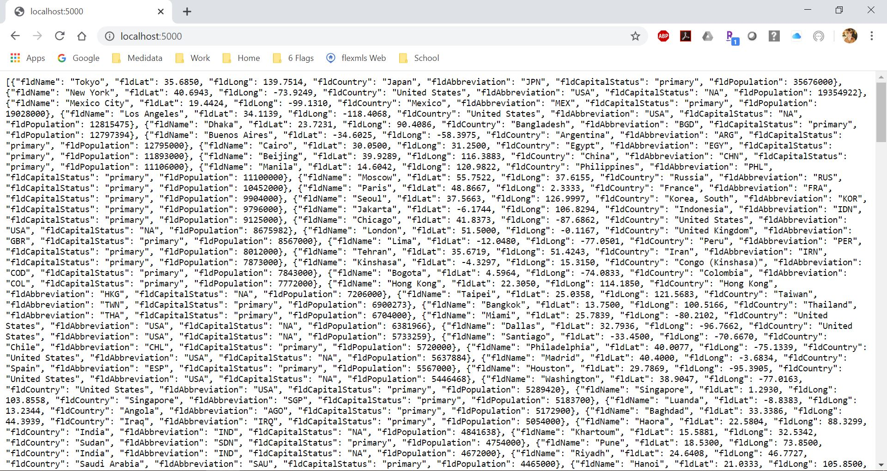
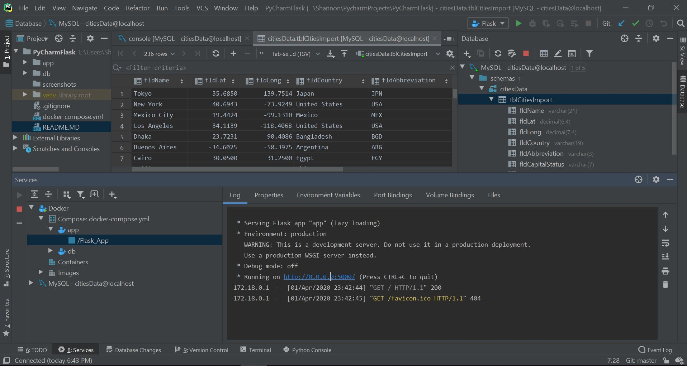
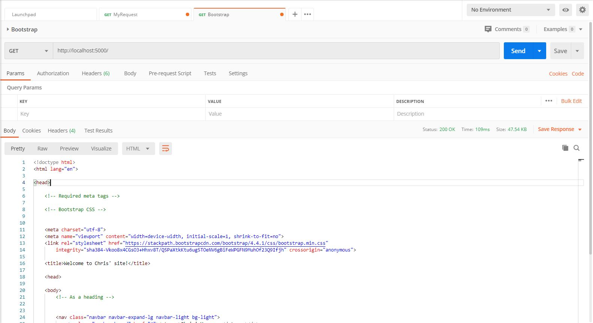
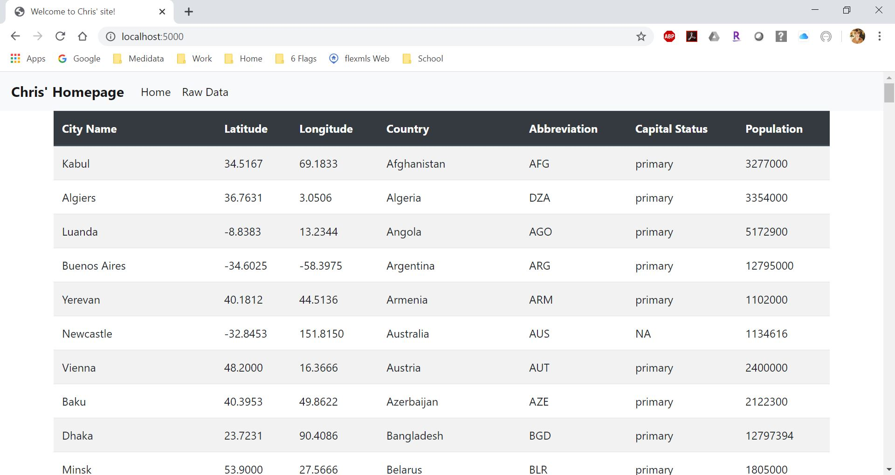

# Project Description
This project is a homework assignment to teach how to get Pycharm setup with Docker, Flask, MySQL
# Postman Screenshot

# LocalHost:5000 Screenshot

# Pycharm DB Screenshot

# Postman Bootstrap Screenshot

# LocalHost:5000 Bootstrap Screenshot
 
